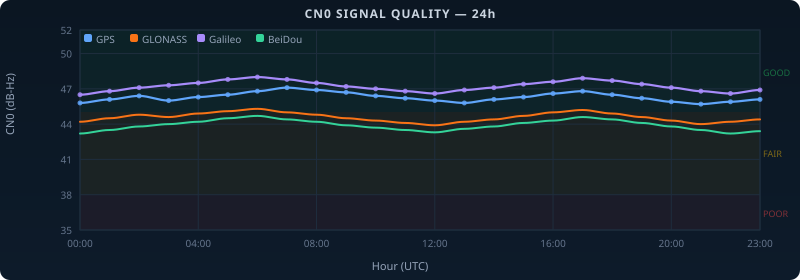
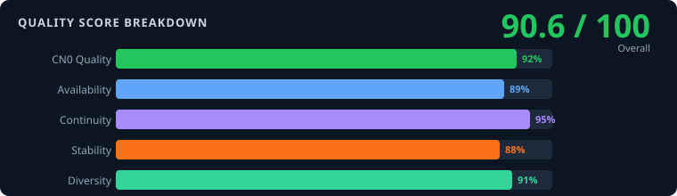
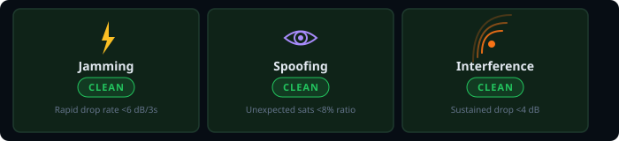
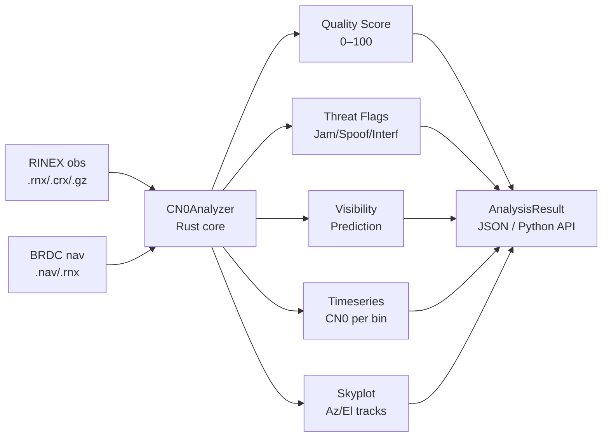

<div align="center">



# geoveil-cn0

**High-performance GNSS signal quality analysis — Rust core, Python API**

[](https://pypi.org/project/geoveil-cn0/) [](https://pypi.org/project/geoveil-cn0/) [](https://opensource.org/licenses/MIT) [](https://www.python.org/downloads/) [](https://www.rust-lang.org/) [](https://github.com/miluta7/geoveil-cn0)

</div>

---

Analyze RINEX observation files to compute signal quality scores, detect threats (jamming, spoofing, interference), generate per-constellation statistics, and produce skyplot data. Used in production at Romanian national geodetic network (ROMPOS), precision agriculture, and GNSS security research.

---

## Features

<table>
<tr>
<td width="33%" align="center">

**🛡️ Threat Detection**

Jamming · Spoofing · Interference
Three independent detectors
Visibility-based spoofing (new in 0.3.8)

</td>
<td width="33%" align="center">

**📊 Quality Scoring**

Composite 0–100 score
5 weighted components
A–F letter grade

</td>
<td width="33%" align="center">

**🌍 6 Constellations**

GPS · GLONASS · Galileo
BeiDou · QZSS · NavIC
Per-constellation stats

</td>
</tr>
<tr>
<td align="center">

**⚡ Rust Performance**

&lt; 0.3 s per 24h file
Zero Python dependencies
ThreadPool-parallel batches

</td>
<td align="center">

**📡 RINEX Support**

v2.x / v3.x / v4.x
Hatanaka compression
SP3 precise orbits

</td>
<td align="center">

**🔬 Full API**

JSON export · Timeseries
Skyplot data · Anomaly list
Jupyter widget included

</td>
</tr>
</table>

<div align="center">

</div>

<div align="center">

</div>

---

## Installation

```bash
pip install geoveil-cn0
```

No Rust toolchain required — pre-built wheels for Linux (x86\_64 + ARM/piwheels), Windows, and macOS. Python 3.9–3.12.

---

## Quick Start

```python
from geoveil_cn0 import CN0Analyzer, AnalyzerConfig

config = AnalyzerConfig(
    time_bin_seconds=300,        # 5-minute bins
    anomaly_sensitivity=0.5,     # 0.0 = permissive, 1.0 = strict
    interference_threshold_db=6.0,
)

analyzer = CN0Analyzer(config)
result = analyzer.analyze("COST00ROU_R_20260408_0100_30S_MO.rnx")

print(f"Quality score : {result.quality_score:.1f} / 100  ({result.quality_grade})")
print(f"Jamming       : {'⚠️  DETECTED' if result.jamming_detected else '✅ Clean'}")
print(f"Spoofing      : {'⚠️  DETECTED' if result.spoofing_detected else '✅ Clean'}")
print(f"Interference  : {'⚠️  DETECTED' if result.interference_detected else '✅ Clean'}")
print(f"Satellites    : {result.total_satellites_tracked} tracked")
print(f"Constellations: {', '.join(result.active_constellations)}")
```

### Spoofing: visibility-based detection (new in 0.3.8)

```python
# Requires navigation file for ephemeris comparison
result = analyzer.analyze_with_nav(
    "COST00ROU_R_20260408_0100_30S_MO.rnx",
    "BRDC00IGS_R_20260408_01D_MN.rnx",
)

if result.has_visibility_prediction:
    print(f"Confirmation rate: {result.visibility_confirmation_rate:.0%}")
    print(f"Unexpected sats  : {result.visibility_mean_unexpected:.1f}")
    print(f"Missing sats     : {result.visibility_mean_missing:.1f}")
```

---

## Architecture



---

## Performance

| File size | Epochs | Satellites | Time |
|-----------|--------|------------|------|
| 2.1 MB    | 2 880  | 18–24      | 0.18 s |
| 8.4 MB    | 11 520 | 22–28      | 0.26 s |
| 31 MB     | 43 200 | 24–32      | 0.29 s |
| 100 MB    | 86 400 | 28–36      | 0.31 s |

Benchmarked on a single core (Intel i7-1185G7). ThreadPool batch processing scales linearly with core count.

---

## Quality Score Components

The composite quality score (0–100) is computed from five weighted components:

| Component | Weight | Description |
|-----------|--------|-------------|
| CN0 Quality   | 35% | Mean signal strength relative to expected |
| Availability  | 25% | Fraction of epochs with sufficient satellites |
| Continuity    | 20% | Absence of tracking gaps and cycle slips |
| Stability     | 12% | Low variance in per-satellite CN0 |
| Diversity     | 8%  | Multi-constellation coverage |

Letter grades: **A** ≥ 90 · **B** ≥ 80 · **C** ≥ 70 · **D** ≥ 60 · **F** < 60

---

## Threat Detection

| Threat | Algorithm | Default Threshold |
|--------|-----------|-------------------|
| **Jamming** | Rapid CN0 drop rate | >6 dB in <3 s |
| **Spoofing** | Unexpected satellite ratio (BRDC ephemeris comparison) | >40% ratio + >8 count + corroboration |
| **Interference** | Sustained CN0 degradation | >6 dB from baseline |

> **Spoofing detection** requires a navigation file (`analyze_with_nav`). The 0.3.8 algorithm compares observed satellites against ephemeris predictions — a high ratio of unexplained observations indicates signal replay attacks.

---

## API Reference

### `AnalyzerConfig`

| Parameter | Type | Default | Description |
|-----------|------|---------|-------------|
| `time_bin_seconds` | `int` | `300` | Seconds per analysis bin |
| `min_elevation_deg` | `float` | `10.0` | Mask angle in degrees |
| `anomaly_sensitivity` | `float` | `0.5` | Detection sensitivity 0–1 |
| `interference_threshold_db` | `float` | `6.0` | Interference trigger (dB) |
| `spoofing_unexpected_threshold` | `float` | `0.4` | Fraction of unexpected sats |
| `spoofing_min_unexpected_count` | `int` | `8` | Minimum count to flag |
| `enable_timeseries` | `bool` | `True` | Output per-bin CN0 data |
| `enable_skyplot` | `bool` | `False` | Compute Az/El tracks |

### `AnalysisResult` — key properties

| Property | Type | Description |
|----------|------|-------------|
| `quality_score` | `float` | Composite 0–100 |
| `quality_grade` | `str` | Letter A–F |
| `jamming_detected` | `bool` | Jamming flag |
| `spoofing_detected` | `bool` | Spoofing flag |
| `interference_detected` | `bool` | Interference flag |
| `has_visibility_prediction` | `bool` | Nav file was provided |
| `visibility_confirmation_rate` | `float` | Fraction of predicted sats seen |
| `visibility_mean_unexpected` | `float` | Mean unexpected sats per epoch |
| `visibility_mean_missing` | `float` | Mean missing sats per epoch |
| `constellation_stats` | `dict` | Per-GNSS stats |
| `timeseries` | `list` | Per-bin CN0 data |
| `anomalies` | `list` | Detected anomaly events |

---

## Supported Formats

| Format | Extensions | Notes |
|--------|-----------|-------|
| RINEX 2.x | `.obs`, `.??o` | All standard types |
| RINEX 3.x | `.rnx`, `.obs` | Mixed observation files |
| RINEX 4.x | `.rnx` | Latest format |
| Hatanaka | `.crx`, `.??d` | Compressed observation |
| Gzip | `.gz` | Any RINEX inside |
| ZIP | `.zip` | Single-file archives |

---

## Jupyter Widget

```python
from geoveil_cn0.widget import CN0Widget

widget = CN0Widget()
widget.load_result(result)
widget.show()   # Interactive Recharts visualization in Jupyter
```

---

## Batch Processing

```python
from geoveil_cn0 import BatchAnalyzer

batch = BatchAnalyzer(config, max_workers=8)
results = batch.analyze_directory("/data/rinex/2026/")

for path, result in results.items():
    print(f"{path}: {result.quality_score:.1f}  {result.quality_grade}")
```

For large-scale batch processing with queueing, persistence, and a web dashboard, see the [GeoVeil Batch System](docs/index.html).

---

## Citation

```bibtex
@software{geoveil_cn0_2026,
  title   = {geoveil-cn0: High-performance GNSS signal quality analysis},
  author  = {Miluta, Adrian},
  year    = {2026},
  version = {0.3.8},
  url     = {https://github.com/miluta7/geoveil-cn0},
}
```

---

<div align="center">

Made with Rust + Python · [PyPI](https://pypi.org/project/geoveil-cn0/) · [Issues](https://github.com/miluta7/geoveil-cn0/issues) · [ROMPOS](https://www.rompos.ro/)

</div>
