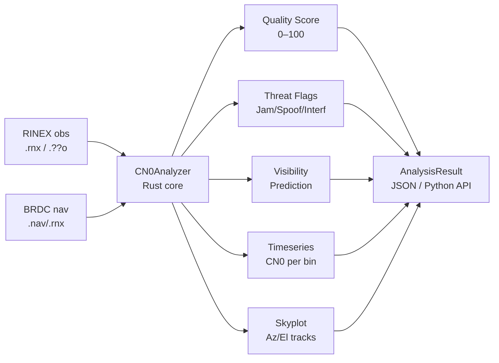

<div align="center">


<sub>Real geoveil-cn0 output · BOR1 (EPN) · 31 December 2025 · <a href="https://miluta7.github.io/geoveil-cn0/">interactive version</a></sub>

# geoveil-cn0

**High-performance GNSS signal quality analysis — Rust core, Python API**

[](https://pypi.org/project/geoveil-cn0/) [](https://pypi.org/project/geoveil-cn0/) [](LICENSE) [](https://www.python.org/downloads/) [](https://www.rust-lang.org/) [](https://github.com/miluta7/geoveil-cn0)

</div>

---

Analyze RINEX observation files to compute signal quality scores, detect threats (jamming, spoofing, interference), generate per-constellation statistics, and produce skyplot data. Used in production at Romanian national geodetic network (ROMPOS), precision agriculture, and GNSS security research.

---

## Features

<table>
<tr>
<td width="33%" align="center">

**🛡️ Threat Detection**

Jamming · Spoofing · Interference
Three independent detectors
Visibility-based spoofing (new in 0.3.8)

</td>
<td width="33%" align="center">

**📊 Quality Scoring**

Composite 0–100 score
5 weighted components
A–F letter grade

</td>
<td width="33%" align="center">

**🌍 6 Constellations**

GPS · GLONASS · Galileo
BeiDou · QZSS · NavIC
Per-constellation stats

</td>
</tr>
<tr>
<td align="center">

**⚡ Rust Performance**

0.14–2.6 s per 24 h file
Zero Python dependencies
ThreadPool-parallel batches

</td>
<td align="center">

**📡 RINEX Support**

v2.x / v3.x / v4.x
Broadcast navigation
Visibility prediction

</td>
<td align="center">

**🔬 Full API**

JSON export · Timeseries
Skyplot data · Anomaly list
Desktop GUI script included

</td>
</tr>
</table>

<div align="center">


<sub>Quality score and components from <code>analyze_with_nav</code> · BUCU (Bucharest) · 1 h at 1 Hz</sub>
</div>

<div align="center">


<sub>Mean CN0 by elevation per constellation · BOR1 · 24 h at 30 s</sub>
</div>

---

## Installation

```bash
pip install geoveil-cn0
```

No Rust toolchain required — pre-built wheels for Linux (x86\_64 + ARM/piwheels), Windows, and macOS. Python 3.9–3.12.

---

## Quick Start

```python
from geoveil_cn0 import AnalysisConfig, CN0Analyzer

config = AnalysisConfig(
    min_elevation=10.0,          # mask angle, degrees
    time_bin_seconds=60,         # 1-minute bins
    anomaly_sensitivity=0.5,     # 0.0 = permissive, 1.0 = strict
    interference_threshold_db=6.0,
)

analyzer = CN0Analyzer(config)
result = analyzer.analyze_file("COST00ROU_R_20260980000_01D_30S_MO.rnx")

q = result.quality_score
print(f"Quality score : {q.overall:.1f} / 100  ({q.rating})")
print(f"Jamming       : {'DETECTED' if result.jamming_detected else 'clean'}")
print(f"Spoofing      : {'DETECTED' if result.spoofing_detected else 'clean'}")
print(f"Interference  : {'DETECTED' if result.interference_detected else 'clean'}")
print(f"Satellites    : {result.total_satellites} tracked")
print(f"Constellations: {', '.join(result.get_systems())}")
```

geoveil-cn0 reads plain RINEX. Decompress Hatanaka (`.crx`, `.??d`) and gzip files first, for example with the [`hatanaka`](https://pypi.org/project/hatanaka/) package: `hatanaka.decompress_on_disk("file.crx.gz")`.

### Spoofing: visibility-based detection (new in 0.3.8)

```python
# Requires navigation file for ephemeris comparison
result = analyzer.analyze_with_nav(
    "COST00ROU_R_20260408_0100_30S_MO.rnx",
    "BRDC00IGS_R_20260408_01D_MN.rnx",
)

if result.has_visibility_prediction:
    print(f"Confirmation rate: {result.visibility_confirmation_rate:.0f}%")
    print(f"Unexpected sats  : {result.visibility_mean_unexpected:.1f}")
    print(f"Missing sats     : {result.visibility_mean_missing:.1f}")
```

---

## Architecture


```mermaid
flowchart LR
    A["RINEX obs\n.rnx / .??o"] --> C
    B["BRDC nav\n.nav/.rnx"] --> C
    C["CN0Analyzer\nRust core"] --> D["Quality Score\n0–100"]
    C --> E["Threat Flags\nJam/Spoof/Interf"]
    C --> F["Visibility\nPrediction"]
    C --> G["Timeseries\nCN0 per bin"]
    C --> H["Skyplot\nAz/El tracks"]
    D & E & F & G & H --> I["AnalysisResult\nJSON / Python API"]
```

---

## Performance

Public IGS files from 31 December 2025, plain RINEX, one core of an Intel Xeon E5-2620 v3 (2014), median of three runs, `min_elevation=10`, 60 s bins:

| File | Size | Epochs × sats | `analyze_file` | `analyze_with_nav` | Peak memory |
|---|---|---|---|---|---|
| RINEX 2.11 · 24 h · 30 s · ZIMM (GPS) | 5.4 MB | 2,880 × 32 | 0.14 s | 4.31 s | 104 MB |
| RINEX 3.02 · 24 h · 30 s · BOR1 (6 GNSS) | 19.4 MB | 2,880 × 106 | 2.57 s | 7.97 s | 446 MB |
| RINEX 3.05 · 15 min · 1 Hz · BUCU | 9.6 MB | 900 × 44 | 0.99 s | 2.62 s | 201 MB |
| RINEX 3.05 · 1 h · 1 Hz · BUCU | 39.9 MB | 3,600 × 52 | 3.78 s | 9.98 s | 739 MB |
| RINEX 3.05 · 24 h · 1 Hz · BUCU | 948.1 MB | 86,400 × 127 | 129.1 s | 263.8 s | 14.2 GB |

The analysis is single-threaded; `CN0Analyzer` is stateless, so a `ThreadPoolExecutor` over files scales with the cores available. `analyze_with_nav` adds visibility prediction from broadcast ephemeris.

---

## Quality Score Components

The composite quality score (0–100, `result.quality_score`) is computed from five weighted components:

| Component | Weight | Description |
|-----------|--------|-------------|
| CN0 Quality   | 30% | Mean signal strength: 0 at 30 dB-Hz, 100 at 45 dB-Hz |
| Availability  | 25% | Satellites observed / satellites expected |
| Continuity    | 20% | Absence of tracking gaps |
| Stability     | 15% | Low CN0 standard deviation: 100 at 2 dB-Hz, 0 at 10 dB-Hz |
| Diversity     | 10% | Constellations observed (4 = 100%) |

Rating: **A** ≥ 90 · **B** ≥ 80 · **C** ≥ 70 · **D** ≥ 60 · **F** < 60. `result.score` and `result.quality_grade` report the same score.

---

## Threat Detection

| Threat | Algorithm | Default Threshold |
|--------|-----------|-------------------|
| **Jamming** | Rapid CN0 drop rate | >6 dB in <3 s |
| **Spoofing** | Unexpected satellite ratio (BRDC ephemeris comparison) | >40% ratio + >8 count + corroboration |
| **Interference** | Sustained CN0 degradation | >6 dB from baseline |

> **Spoofing detection** requires a navigation file (`analyze_with_nav`). The 0.3.8 algorithm compares observed satellites against ephemeris predictions — a high ratio of unexplained observations indicates signal replay attacks.

---

## API Reference

### `AnalysisConfig`

| Parameter | Type | Default | Description |
|-----------|------|---------|-------------|
| `min_elevation` | `float` | `5.0` | Mask angle in degrees |
| `time_bin_seconds` | `int` | `60` | Seconds per analysis bin |
| `systems` | `list[str]` | all | Constellations to analyze, e.g. `["G", "R", "E", "C"]` |
| `detect_anomalies` | `bool` | `True` | Run the anomaly detectors |
| `anomaly_sensitivity` | `float` | `0.5` | Detection sensitivity 0–1 |
| `interference_threshold_db` | `float` | `6.0` | Interference trigger (dB) |
| `spoofing_unexpected_threshold` | `float` | `0.40` | Fraction of unexpected satellites |
| `spoofing_min_unexpected_count` | `float` | `8` | Minimum count to flag |

### `CN0Analyzer`

| Method | Description |
|--------|-------------|
| `analyze_file(obs_path)` | Analyze an observation file |
| `analyze_with_nav(obs_path, nav_path)` | Also predict visibility from broadcast ephemeris (spoofing check, skyplot) |

### `AnalysisResult` — key members

| Member | Type | Description |
|--------|------|-------------|
| `quality_score` | `QualityScore` | `overall`, `rating`, `cn0_quality`, `availability`, `continuity`, `stability`, `diversity` |
| `quality_grade` | `str` | Letter A–F |
| `jamming_detected` / `spoofing_detected` / `interference_detected` | `bool` | Threat flags |
| `mean_cn0`, `min_cn0`, `max_cn0` | `float` | CN0 statistics (dB-Hz) |
| `total_epochs`, `total_satellites` | `int` | File size in epochs and satellites |
| `visibility_confirmation_rate` | `float` | Percent of predicted satellites observed (with nav) |
| `get_systems()` | `list` | Constellations present |
| `get_constellation_summary(name)` | `dict` | Per-constellation CN0 and satellite counts |
| `get_timeseries_data()` | `dict` | `hours`, `mean_cn0`, `satellite_count` per epoch |
| `get_skyplot_data()` | `list` | Per-satellite azimuth, elevation and CN0 tracks (with nav) |
| `get_anomalies()` | `list` | Detected anomaly events |
| `to_json()` | `str` | Full result as JSON |

---

## Supported Formats

| Input | Extensions | Notes |
|-------|-----------|-------|
| RINEX 2.x observation | `.??o`, `.obs` | |
| RINEX 3.x / 4.x observation | `.rnx`, `.obs` | Mixed observation files |
| RINEX navigation | `.rnx`, `.??n`, `.??p` | For `analyze_with_nav` |

Compressed files (Hatanaka `.crx`/`.??d`, gzip, ZIP) must be decompressed first.

---

## Website

[miluta7.github.io/geoveil-cn0](https://miluta7.github.io/geoveil-cn0/): live CN0 skyplot, per-constellation signal curves and benchmarks from real geoveil-cn0 output.

---

## Live Demo

**[batch.geoveil-rinex.eu](https://batch.geoveil-rinex.eu)** — the GeoVeil batch dashboard runs this library in production: CN0 quality scoring, threat detection, skyplots and heatmaps for every processed RINEX file, plus advanced multipath sessions (per-code MP RMS, cycle slips, SNR-residual wavelet spectra, Fresnel zones) and long-term trend monitoring on daily 30 s station data.

---

## Batch Processing

For large-scale processing this library is wrapped by the GeoVeil batch system (FastAPI + Celery + MongoDB + MinIO + React dashboard): parallel workers, automatic BRDC ephemeris download, per-session analysis settings, WebSocket progress, and result persistence. See the [live demo](https://batch.geoveil-rinex.eu) above. For local scripting, `CN0Analyzer` is stateless — instantiate one per thread and process files with a `ThreadPoolExecutor`.

---

## License

[PolyForm Noncommercial 1.0.0](https://polyformproject.org/licenses/noncommercial/1.0.0) with an attribution term — see [LICENSE](LICENSE).

Free for research, education, personal and other non-commercial use, provided you credit the author and cite the library (see Citation below). **Commercial use requires a separate license** — contact [miluta.flueras@cartografie.ro](mailto:miluta.flueras@cartografie.ro).

## Citation

```bibtex
@software{geoveil_cn0_2026,
  title   = {geoveil-cn0: High-performance GNSS signal quality analysis},
  author  = {Dulea-Flueras, Miluta},
  year    = {2026},
  version = {0.4.2},
  url     = {https://github.com/miluta7/geoveil-cn0},
}
```

---

<div align="center">

Made with Rust + Python · [PyPI](https://pypi.org/project/geoveil-cn0/) · [Issues](https://github.com/miluta7/geoveil-cn0/issues) · [ROMPOS](https://www.rompos.ro/)

</div>
